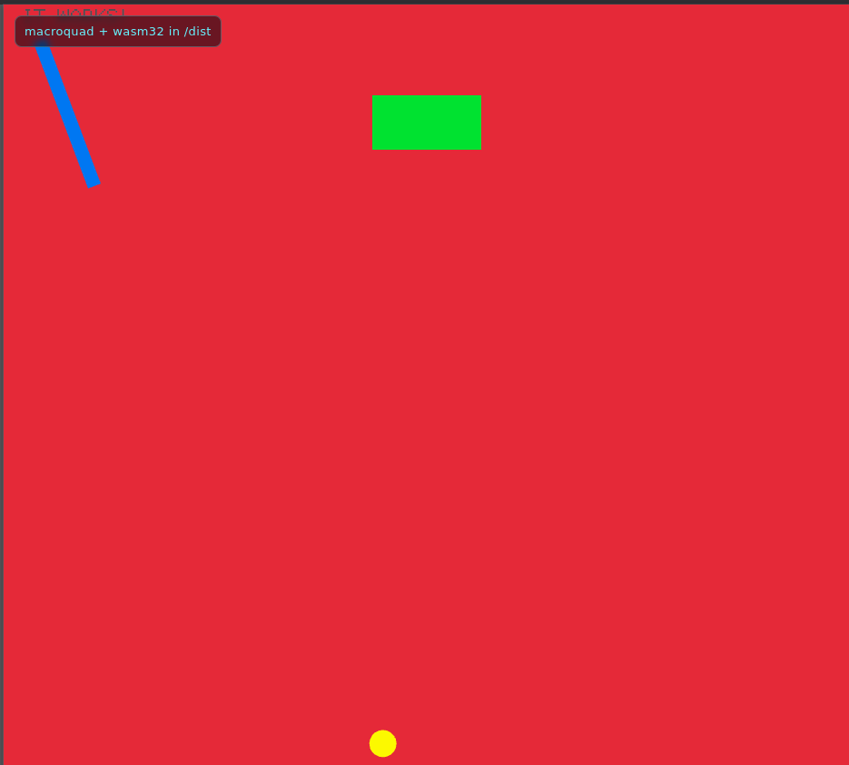

# trying-wasm-macroquad

Small Rust playground for running a `macroquad` app in the browser via WebAssembly, served by a tiny `warp` server.

## Project origin

- First commit: `2c4f0dda5e42c9d1cf25fe9e2627b709e1973898`
- Commit date: `2024-03-15T20:33:12-05:00`
- Commit message: `Initial commit`

## Screenshot



## Prerequisites

- Rust + Cargo
- `rustup`

## Quick start

```bash
./scripts/dev_web.sh
```

Then open `http://127.0.0.1:3030`.

## Useful commands

Build web assets only:

```bash
./scripts/build_web.sh
```

Serve existing `dist/` assets only:

```bash
cargo run -p server
```

If port `3030` is already in use:

```bash
pkill -f target/debug/server
```

## Output layout

- `dist/index.html`
- `dist/mq_js_bundle.js`
- `dist/app.wasm`
